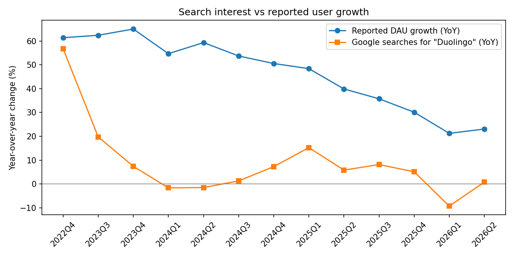
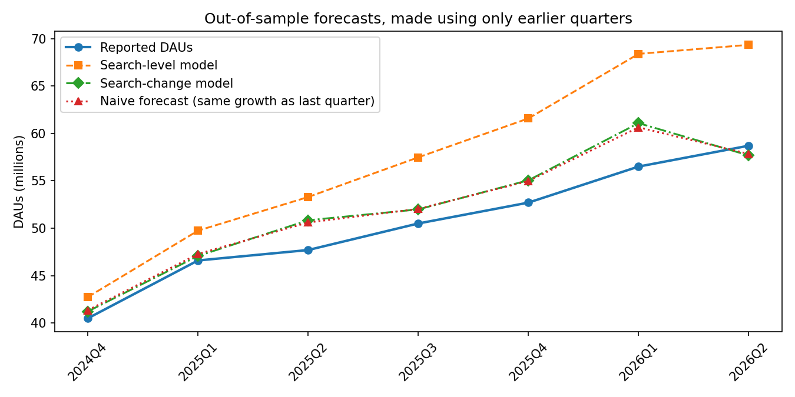

# Can Google searches predict Duolingo's user growth?

Duolingo reports daily active users (DAUs) once a quarter, a few weeks after the quarter ends. Google search interest is free and updates weekly. This project tests whether search data could have told an investor how DAU growth was trending **before** each earnings release, and uses it to make a prediction for the next quarter ahead of time.

I hold Duolingo in my own portfolio, so I wanted a way to check the user growth story with data instead of waiting for the shareholder letter.

## Data

- **DAUs:** 17 quarters from Duolingo's shareholder letters and press releases (Q4 2021, then Q3 2022 to Q2 2026). Every number links to its source in `data/duolingo_dau.csv`.
- **Search interest:** weekly Google Trends data for "Duolingo", worldwide, over a 5-year window (one consistent 0 to 100 scale), averaged by quarter.

## Method

1. **Compare growth, not levels.** Both series trend up, so their raw levels correlate whether or not one predicts the other. I compare year-over-year growth instead, which also removes seasonality (the January resolution spike).
2. **Test out-of-sample.** For each quarter, the model is fit only on earlier quarters, then predicts that quarter. That is what an analyst could have actually known at the time.
3. **Beat a benchmark.** The bar is a naive forecast that assumes DAU growth stays the same as last quarter. A signal that can't beat this isn't useful.
4. **Two models:**
   - *Search-level model:* DAU growth regressed on search growth.
   - *Search-change model:* last quarter's DAU growth, adjusted by how much search growth moved since then. This asks the more practical question: does a turn in search interest signal a turn in user growth?

## Results

**Short answer: no. Worldwide Google searches stopped tracking Duolingo's growth after 2023.**

| | Result |
|---|---|
| Quarters compared (YoY growth) | 13 (Q4 2022 to Q2 2026) |
| Correlation, search growth vs DAU growth | 0.45 |
| Out-of-sample quarters tested | 7 |
| Error, naive benchmark (same growth as last quarter) | 1.89M DAUs |
| Error, search-level model | 7.05M DAUs (272% worse) |
| Error, search-change model | 1.97M DAUs (4% worse) |
| Search-change model calling acceleration vs deceleration | 3 of 7 quarters (43%) |



**What happened:** search interest roughly plateaued from 2023 onward, sitting at about 55 to 65 on the Trends scale, while DAUs nearly tripled from 21.4M to 58.7M. The 0.45 correlation comes mostly from both series slowing down over the period, not from search predicting the turns. The search-level model fails worst because it learned the early relationship (Q4 2022, when both grew around 60%) and kept predicting growth that searches no longer supported.

**Why that's interesting:** if users keep growing while searches stay flat, the growth is not coming from people discovering Duolingo through Google. It is more likely coming from existing users returning more often (streaks, notifications, gamification) and from installs that go straight through app stores and social media. In other words, Duolingo's growth since 2023 looks driven by retention and engagement rather than new-user discovery. That is a hypothesis this data can't prove on its own (see next steps).



## Prediction for Q3 2026

Made on 2 October 2026, before Duolingo reports Q3 2026. Search interest for the quarter was down 12.8% year over year, the second negative reading in three quarters.

| | DAUs | YoY growth |
|---|---|---|
| Naive benchmark (Q2 growth carried forward) | 62.2M | 23.1% |
| Search-change model | 62.0M | 22.9% |
| Search-level model (shown for completeness, not trusted given its track record) | 69.4M | 37.4% |
| Reported | _fill in after the release_ | |

My call is about **62M**. Given the results above, the search signal adds almost nothing beyond the trend, so the real test is whether the benchmark holds.

## Next steps

- **Signals closer to the product:** app store rankings or download estimates, and Wikipedia page views, may track usage better than search.
- **Country-level search:** worldwide search mixes mature and fast-growing markets. Checking, say, the US against India could show where search still works.
- **Explain retention directly:** compare DAU/MAU (the share of monthly users who show up daily) with search, to test the retention story above.

## Limitations

- **Small sample.** About 13 quarters have growth figures for both series, and the out-of-sample test covers only around 7. Treat results as a directional signal, not a trading model.
- **Searches are not users.** Most DAUs open the app directly without searching. Search interest mainly tracks new and returning users and brand buzz (for example, viral marketing), so it may miss changes in how often existing users come back.
- **Google Trends is relative and sampled.** Values are scaled 0 to 100 within the request and can shift slightly between downloads.
- **Worldwide search mixes markets.** Growth in one country can be masked by another. A country-level version is a natural next step.

## Run it

```bash
pip install -r requirements.txt
python src/fetch_trends.py   # or download the CSV by hand, see the top of that file
python src/analysis.py
```

Outputs land in `outputs/`: `results.md` plus two charts.
