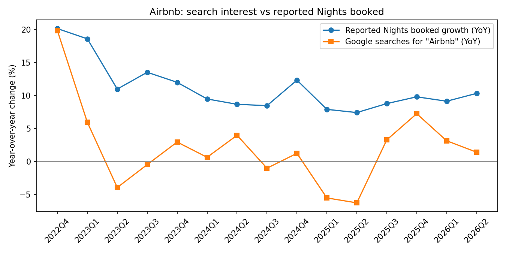
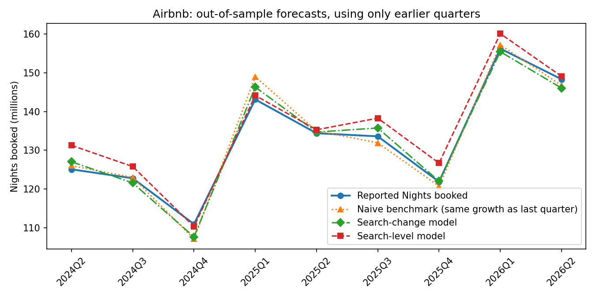

# Airbnb (ABNB): Google searches vs nights booked

KPI: nights and experiences booked, 22 quarters (Q1 2021 to Q2 2026) from Airbnb's shareholder letters. Every number links to its source in [`kpi.csv`](kpi.csv).

## Results

**Short answer: yes, modestly. Search interest helps call turns in Airbnb's booking growth, unlike at Duolingo.**

| | Result |
|---|---|
| Quarters compared (YoY growth) | 15 (Q4 2022 to Q2 2026) |
| Correlation, search growth vs booking growth | 0.71 |
| Out-of-sample quarters tested | 9 |
| Error, naive benchmark (same growth as last quarter) | 1.87M nights |
| Error, search-change model | 1.70M nights (9% better) |
| Error, search-level model | 2.87M nights (53% worse) |
| Search-change model calling acceleration vs deceleration | 7 of 9 quarters (78%) |

**What happened:** booking growth has been fairly steady at roughly 7% to 12% since 2024, and search growth moved with its turns. Both dipped in early 2025 and recovered through the second half. The search-change model, which adjusts last quarter's growth by how much search growth moved, beat the benchmark and called the direction of the next quarter right 7 times out of 9. The search-level model did worse than the benchmark because search growth runs consistently below booking growth, so a direct mapping between the two is unstable.

**Why it works here and not for Duolingo:** a trip usually starts with a search. People look up Airbnb when they plan travel, so search interest is close to the moment of demand. Duolingo is a daily habit app: once someone has it installed, they open it directly, so searches stop reflecting usage.

**How much to trust it:** a 9% edge over 9 test quarters is encouraging but not conclusive. One or two quarters going the other way would erase it. The 0.71 correlation is also flattered by the post-pandemic rebound in Q4 2022, when both series grew around 20%.

## Prediction for Q3 2026

Made on 2 October 2026, before Airbnb reports Q3 2026. Search interest for the quarter was down 12.6% year over year, the weakest reading in the sample.

| | Nights booked | YoY growth |
|---|---|---|
| Naive benchmark (Q2 growth carried forward) | 147.4M | 10.3% |
| Search-change model | 142.0M | 6.3% |
| Search-level model (shown for completeness, not trusted given its record) | 140.1M | 4.9% |
| Reported | _fill in after the release_ | |

This is a real test: the search signal points to a clear slowdown that the trend alone would not predict. My call is about **142M**, a slowdown to roughly 6% growth.

One risk to this call: Google search volumes overall may be shifting as more people get answers from AI assistants and AI search summaries. A broad decline in searching would show up as weaker search interest without any real drop in travel demand.
